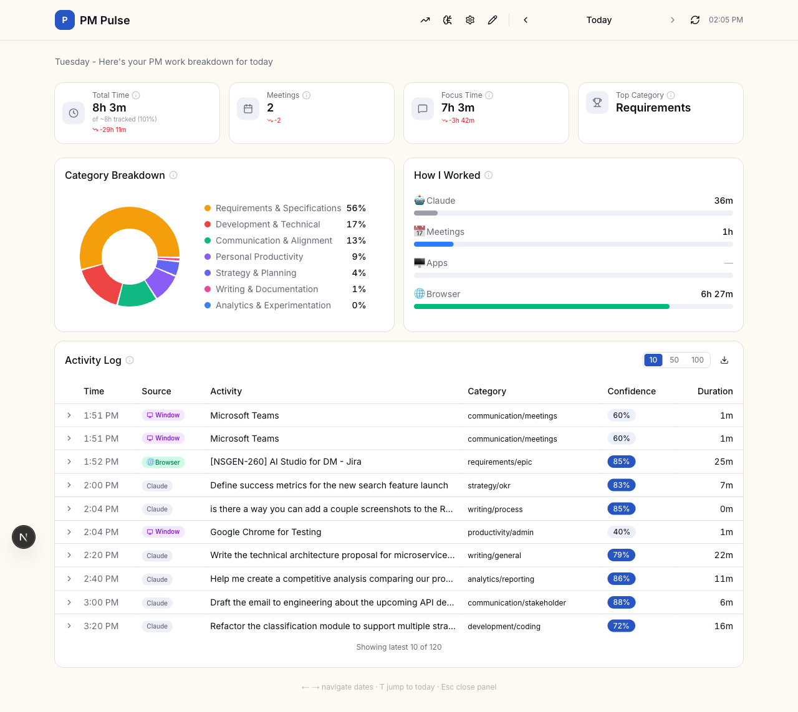
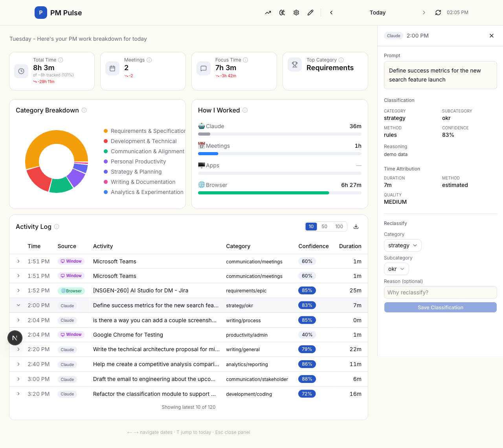

# PM Pulse

**A local-first productivity tracker built for PMs doing AI-native work.**

Most PMs have no honest answer to "how did you spend your time this week?" Calendar blocks don't capture deep work. Manual timers don't survive contact with reality. And generic trackers see "Claude Code: 3 hours" as a single opaque chunk - they have no idea you were writing a PRD, reviewing architecture, and debugging a spec all in the same session.

PM Pulse passively observes what you're actually doing - your Claude Code prompts, browser research, app usage, and calendar events - classifies each into a PM-specific work taxonomy, and gives you an honest breakdown of where your time actually went.

All data stays on your machine. No accounts. No cloud. No subscriptions.

---

## Screenshots


*Daily dashboard - summary cards, category breakdown, source breakdown, and activity log*


*Activity detail sidebar - full prompt, classification with reasoning, confidence score, and reclassify UI*

---

## Who it's for

PMs who:
- Work heavily with Claude Code or AI coding assistants
- Want to understand their time distribution across PM activities (strategy vs. execution vs. communication)
- Care about privacy - you're working on unreleased products, internal strategy, confidential roadmaps
- Are frustrated that existing tools can't tell the difference between "2 hours of strategy work" and "2 hours of Slack"

---

## What makes it different

| | PM Pulse | Other time trackers |
|---|---|---|
| Understands Claude prompts | Yes - captures what you actually asked | No - just "app open: X min" |
| PM-specific taxonomy | 7 categories mapped to PM work | Generic project/client tags |
| Explainable classifications | Reasoning + confidence per activity | Black box |
| Data privacy | 100% local, never leaves your machine | Cloud-stored |
| Cost | Free | Typically $10-20/mo |
| Works with confidential work | Yes | Risk of sensitive data in cloud |

---

## Key features

- **Prompt-level intelligence** - captures what you actually asked Claude, not just "app open: X min." Every prompt is classified, reasoned about, and timed.
- **Exact response-time measurement** - a Stop hook fires when Claude finishes responding, measuring the precise duration of every AI interaction.
- **Explainable classifications** - every activity shows its PM category, confidence score, and the reasoning behind the call. Nothing is a black box.
- **PM work taxonomy** - 7 categories built around how PMs actually work: Strategy, Requirements, Communication, Writing, Analytics, Development, Productivity.
- **Multi-source timeline** - Claude prompts, browser tabs, app windows, and calendar events merged into a single daily view. Gaps between prompts are explainable using other source data.
- **100% local** - all data at `~/.pm-pulse/`. Works with confidential roadmaps, unreleased features, internal strategy. Nothing leaves your machine.
- **Override with audit trail** - correct any misclassification; the original is preserved with timestamp and reason.

---

## How it works

PM Pulse captures activity from 4 sources, classifies each into a PM work taxonomy, attributes time, and stores everything locally in SQLite:

1. **Claude Code hooks** fire on every prompt and session event, capturing what you're working on and for how long
2. **Browser tracker** reads your Chromium history (locally, read-only) and classifies sites by domain
3. **Window watcher** polls the frontmost macOS app every 10 seconds
4. **Calendar sync** pulls meetings from an ICS URL (Google Calendar, Outlook)

Everything is classified into one of 7 PM work categories:

| Category | Examples |
|----------|---------|
| Strategy & Planning | Roadmap work, OKRs, vision, research |
| Requirements & Specifications | PRDs, epics, user stories, technical specs |
| Communication & Alignment | Stakeholder updates, presentations, 1:1s |
| Writing & Documentation | PR-FAQs, process docs, general writing |
| Analytics & Experimentation | Data analysis, reporting, A/B tests |
| Development & Technical | Coding, architecture, tooling, debugging |
| Personal Productivity | Learning, admin, meta-work |

---

## Platform requirements

> **macOS is required** for window tracking and browser history access. The dashboard and Claude Code hooks work cross-platform, but the background daemons (window + browser trackers) are macOS-only.

| Requirement | Detail |
|-------------|--------|
| OS | macOS (for full tracking); Linux/Windows supported for dashboard + Claude hooks only |
| Node.js | v18+ |
| Browser tracking | Chrome, Arc, Edge (Chromium-based only - Safari not supported) |
| Claude Code | Required for prompt tracking; hooks registered via `npm run setup` |
| Disk | ~50MB for app; SQLite grows with usage (~1MB/month typical) |

---

## Installation

### 1. Clone and install dependencies

```bash
git clone https://github.com/tshenhar/pm-pulse.git
cd pm-pulse
npm install
```

### 2. Register Claude Code hooks

```bash
npm run setup
```

This adds PM Pulse hooks to `~/.claude/settings.json`. From this point, every Claude Code prompt is automatically captured.

### 3. Start the dashboard

```bash
npm run dev
```

Open [http://localhost:3000](http://localhost:3000).

### 4. Start background trackers

```bash
npm run watch-browser   # browser tab tracker
npm run watch-windows   # macOS app/window tracker
```

These run as background daemons and are required for full tracking coverage. Without them, only Claude Code prompts are captured. To have them start automatically on login:

```bash
node scripts/install-launch-agent.mjs
```

### 5. Connect your calendar

Go to Settings and paste an ICS URL from Google Calendar or Outlook. PM Pulse syncs it every 30 minutes. Without this, meetings won't appear in your activity timeline.

---

## Data storage

All data lives at `~/.pm-pulse/`:

```
~/.pm-pulse/
  pm-pulse.db          # SQLite database (all classified activity)
  events/              # Raw Claude hook events (processed and deleted)
  browser-events/      # Raw browser visit events (processed and deleted)
  window-events/       # Raw window session events (processed and deleted)
```

No data ever leaves your machine unless you explicitly enable LLM classification mode, which calls an external API you configure.

---

## Configuration

Settings are managed via the dashboard at `/settings`. Key options:

- **Privacy mode** - full text / preview only / redacted
- **Classification mode** - rules-based (default, fully local) / hybrid / full LLM
- **Calendar ICS URL** - paste from Google Calendar or Outlook
- **Window and browser tracking** - enable/disable per tracker
- **Tracking exclusions** - exclude specific apps or domains from tracking

---

## Tech stack

- **Framework** - Next.js 16 (App Router, React 19)
- **UI** - shadcn/ui + Tailwind CSS 4 (OKLch color variables)
- **Charts** - Recharts
- **Database** - SQLite via better-sqlite3 (server-side only, never sent to client)
- **Language** - TypeScript 5 (strict mode)

---

## Contributing

PM Pulse is open source and welcomes contributions. Open an issue to discuss a feature or bug before submitting a PR. See the spec and ideas docs in `reference docs/` for context on where the project is headed.

---

## License

MIT
